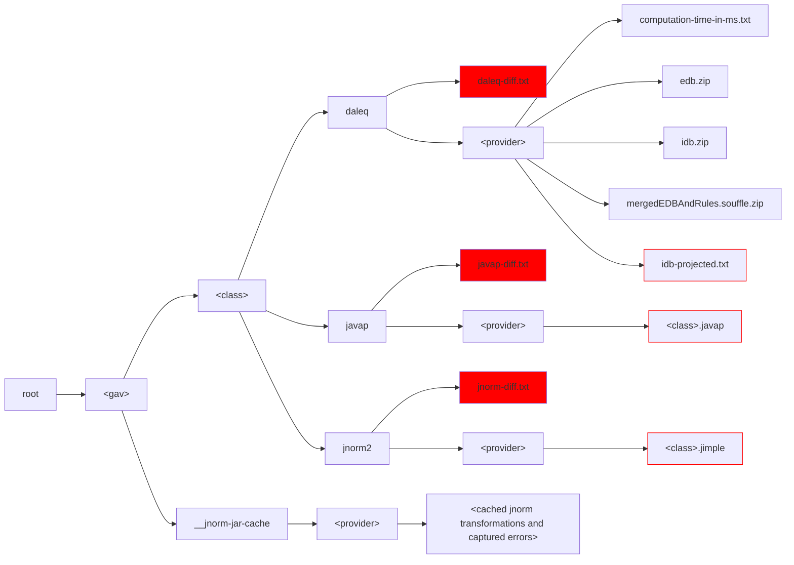

# DALEQ Evaluation Experiments and Examples

## Downloading The Alternative Build Dataset

Download the dataset from [https://zenodo.org/records/14915249](https://zenodo.org/records/14915249). 

## Building 

1. Clone DALEQ from [https://github.com/binaryeq/daleq](https://github.com/binaryeq/daleq).
2. Check the version of DALEQ used in `pom.xml`, and check out the tag corresponding to this. 
3. Locally install DALEQ by running `mvn clean install`.

## Prerequisites

### Download and Install JNorm

Download the *JNorm* from [https://github.com/stschott/jnorm-tool/releases/download/v1.0.0/jnorm-cli-1.0.0.jar](https://github.com/stschott/jnorm-tool/releases/download/v1.0.0/jnorm-cli-1.0.0.jar) and copy it into `tools/`.

### Download and Install Souffle

Follow these [instructions](https://souffle-lang.github.io/install) to download and install souffle.

## Download and Install Java11

To succesfully run *JNorm* we used Java11. The path to the Java 11 _java_ executable is to some experiments as a JVM argument.

# Running Evaluation Experiments

## Equivalence Analysis

1. compute the classpath using `dependency:build-classpath`
2. run `java -cp <classpath> -ea -DSOUFFLE=<souffle-home> -DJAVA11=<java11> io.github.bineq.daleq.evaluation.RunComparativeEvaluation <output-folder> <input1>.tsv <input2>.tsv`

The input files are the *.tsv files from the alternative build dataset,
such as `gav_gaoss.tsv` (for jars from Google GAOSS), `gav_mvnc.tsv` (for jars from Maven Central) and
`gav_obfs.tsv` (for jars from Oracle Build-From-Source)

The expected runtimes (depending on hardware being used) are 3-6 hours for comparing mvnc with obfs, and 2-4 days form comparing mvnc with gaoss. 

The numbers reported in the paper will appear on the console.

The output folders have the following structure:

Diff files used to establish non-equivalence are highlighted with a red background, the 
transformations diffed are highlighted with a red border. 
The zipped EBD / IDBs contain the tables of those databases in TSV format.

## Non-Equivalence Analysis

This analysis is based on a pattern analysis of the `daleq-diff.txt` files created 
during the equivalence analysis.

1. compute the classpath using `dependency:build-classpath`
2. run `java -cp <classpath> -ea <main-class> <output-folder1> <output-folder2>`

The output folders are the root folders where the outputs using in the equivalence analysis. 
They correspond to the mvnc-vs-gaoss and mvnc-vs-obfs comparisons, respectively.

The main classes are as follows:

1. `io.github.bineq.daleq.evaluation.resultanalysis.AnalyseDaleqDiffs` - analyse all pairs of classes that are not daleq-equivalent.
2. `io.github.bineq.daleq.evaluation.resultanalysis.AnalyseDaleqDiffs4JavapEquivalent` - analyse all pairs of classes that are not daleq-equivalent but javap-equivalent. 
3. `io.github.bineq.daleq.evaluation.resultanalysis.AnalyseDaleqDiffs4JNormEquivalent` - analyse all pairs of classes that are not daleq-equivalent but jnorm-equivalent.

## Performance Analysis

Using the same setup as before, use the following main class: 
`io.github.bineq.daleq.evaluation.resultanalysis.ComputeRuntimeStats`.
Results will appear on the console.

